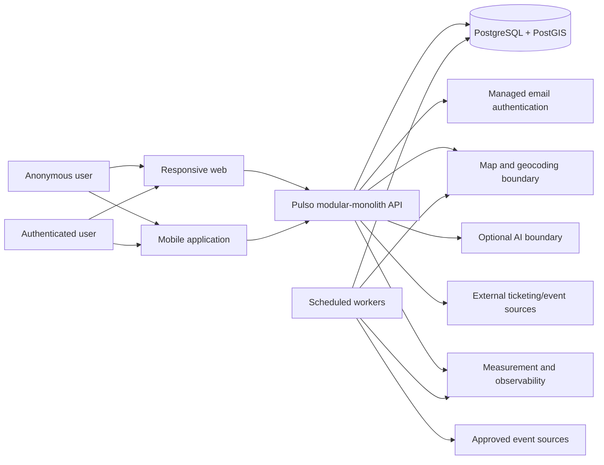

# RFC-0001 — Pulso Core Architecture

**Identifier:** RFC-0001
**Version:** 1.2
**Status:** Accepted
**Dependencies:** PDR-0001, PDR-0002, MVP-0001, DEC-0001, DEC-0014, DATA-0001, UJ-0001, UJ-0002, UX-0001, PRD-0001

## Purpose

Define the smallest production-capable technical architecture for the Accepted Pulso Montréal MVP while preserving strict MVP, Roadmap, and Vision boundaries. This RFC creates no application or configuration files.

## 1. Executive technical decision

Use a **strict TypeScript pnpm monorepo** on **Node.js 24 LTS** and **pnpm 11**, with a **Next.js 16 App Router responsive web app**, **Expo SDK 57 / React Native 0.86 mobile app**, and one **Fastify 5 modular-monolith backend**. Align **React 19.2** initially with Expo's supported patch. Store canonical data in **PostgreSQL with PostGIS**. Use **Drizzle ORM for ordinary relational schema, typed access, and migrations**, reviewed parameterized SQL for spatial behavior, and **Zod 4** runtime contracts. PostgreSQL-backed jobs are the preferred ingestion-stage default, not an initial-scaffold requirement.

Public read APIs support anonymous discovery and client-local favorites without an anonymous server profile, fingerprinting, or hidden account. A managed email-auth provider supports optional account connection and cross-device synchronization of favorites. Source adapters implement ingestion only after source-specific research approves access. Intelligent search is optional and provider-neutral; deterministic retrieval remains authoritative. External ticketing remains outside Pulso. Measurement is privacy-minimized and vendor-neutral.

The MVP does not use microservices, Kubernetes, event streaming, multi-region systems, or Roadmap/Vision infrastructure.

## 2. Architecture drivers

| Driver | Consequence | Source |
| --- | --- | --- |
| Map-first, under 60 seconds | Indexed bounds queries, compact API, preserved map state | PDR-0001/2, UJ-0001/2, PRD MAP/STATE |
| Montréal-only, seven-day window | Montréal configuration and indexed time/space queries; no city platform | MVP-0001, PRD MAP/FILTER |
| Coverage and trust | Adapter pipeline, provenance, conservative deduplication, correction audit | PDR-0001, DATA-0001, PRD EVENT/TRUST |
| Web and mobile same product | Shared domain/contracts; platform-specific UI | DEC-0001, UX-0001, PRD RESPONSIVE |
| Optional AI | Replaceable extraction boundary and deterministic fallback | PDR-0001/2, PRD SEARCH |
| Anonymous discovery and favorites | Public reads and client-local favorites; auth only for voluntary account connection and cross-device synchronization | DEC-0007, PRD AUTH/FAV |
| External redirects | Validated destination records; no transaction data | DEC-0001, PRD REDIRECT |
| Minimal personal data | Managed auth, minimized measurement, retention controls | PRD PRIVSEC/MEASURE |

## 3. Architecture principles

1. Simplest reversible MVP choice.
2. One canonical event model and shared business rules.
3. Shared domain types, contracts, validation, filters, search semantics, and status rules.
4. Manual ingestion/correction when automation is unavailable.
5. Source traceability and auditable changes.
6. Narrow provider boundaries for replaceable external services.
7. No Roadmap/Vision anticipatory complexity.
8. Measurable, testable behavior and secure defaults.

## 4. System context



Ingestion and correction capabilities are internal, never public endpoints.

## 5. Incremental repository structure

The target repository may grow to the following structure only as the corresponding implementation stage begins:

```text
apps/
  web/
  mobile/
  api/
  worker/
packages/
  domain/
  contracts/
  validation/
  database/
  ingestion/
  search/
  observability/
tests/
  fixtures/
  integration/
  e2e-web/
  e2e-mobile/
docs/
```

The initial scaffold creates only:

```text
apps/
  web/
  mobile/
  api/
packages/
  domain/
  contracts/
  database/
tests/
  fixtures/       # synthetic Montréal data only
```

It also creates local PostgreSQL/PostGIS configuration and shared quality commands/configuration. It does not initially create `apps/worker`, separate `packages/validation`, `packages/ingestion`, `packages/search`, or `packages/observability`, and it does not integrate authentication, AI, analytics, deployment, or production observability providers. Validation initially lives with the contract or domain that owns it.

Use a monorepo because two required clients share rules/contracts with one backend. Share domain rules, types, API contracts, schemas, filters, statuses, date logic, and search contracts. Do not share DOM/native visual components by default. Web/mobile own navigation, layout, map SDK integration, accessibility mechanics, links, and platform presentation. Shared packages must not import client frameworks or provider SDKs.

## 6. Technology decision table

The approved major lines are below. Exact dependency patches must be selected, verified, and locked during the scaffold compatibility spike. The exact TypeScript version must be the strict-mode version proven compatible with the Expo SDK 57 scaffold and the full workspace.

| Area | Recommended choice | Reason / rejected alternative | Reversibility | Verification | Official source |
| --- | --- | --- | --- | --- | --- |
| Runtime | Node.js 24 LTS | One supported monorepo runtime | Medium | Exact patch and full matrix pending spike | [Node.js](https://nodejs.org/en/about/previous-releases) |
| Language | TypeScript strict | One language; reject mixed MVP stack | Medium | Exact Expo/workspace-compatible version pending spike | [TypeScript](https://www.typescriptlang.org/docs/) |
| Web | Next.js 16 App Router | Production web; reject hand-built split | Medium | Exact patch/build pending spike | [Next.js](https://nextjs.org/docs/app) |
| Mobile | Expo SDK 57 / React Native 0.86 / React 19.2 | Required native app; reject web wrapper | Medium | Exact patches and native build pending spike | [Expo](https://docs.expo.dev/versions/latest/) |
| Workspace | pnpm 11 workspaces | Strict monorepo; npm fallback | High | Exact patch and clean install pending | [pnpm](https://pnpm.io/workspaces) |
| API | Fastify 5 REST/JSON modular monolith | Client-neutral; reject microservices | High | Exact patch/build pending spike | [Fastify](https://fastify.dev/docs/latest/) |
| Database | PostgreSQL 18 candidate | Canonical transactional store | Medium | Maintained container pair pending spike | [PostgreSQL](https://www.postgresql.org/docs/) |
| Geospatial | PostGIS 3.6 candidate | Indexed bounds/distance; reject app scans | Medium | Extension/container/spatial spike pending | [PostGIS](https://postgis.net/documentation/tips/st-dwithin/) |
| Data access | Drizzle + reviewed parameterized spatial SQL | Typed ordinary queries, transparent PostGIS | High | Spatial spike pending | [Drizzle](https://orm.drizzle.team/docs/get-started-postgresql) |
| Validation | Zod 4 | Shared runtime schemas | High | Contract/build spike pending | [Zod](https://zod.dev/) |
| Auth | Managed email provider, standard tokens | Reduce credential scope; reject self-managed MVP | High | Vendor pending | Provider docs pending |
| Maps | `maplibre-gl` 5 web candidate; `@maplibre/maplibre-react-native` 11 mobile candidate | Provider-neutral rendering | Medium | Expo development-build spike pending | [MapLibre](https://maplibre.org/maplibre-gl-js/docs) |
| Geocoding | Managed provider behind interface | Operational simplicity | High | Vendor/terms pending | Provider docs pending |
| Jobs | PostgreSQL-backed jobs preferred when ingestion begins | Reuse database; reject broker/streaming | High | Exact implementation deferred to ingestion | PostgreSQL-backed candidate docs at ingestion |
| AI | Provider-neutral structured-query interface | Optional/replaceable | High | Provider pending | Provider docs pending |
| Testing | Vitest, DB integration, Playwright; mobile tool after spike | Cohesive test layers | High | Web tools checked | [Vitest](https://vitest.dev/guide/), [Playwright](https://playwright.dev/docs/intro) |
| Format/lint | Prettier + ESLint + TypeScript checks | Conventional separate checks | High | Current versions pending | Official docs at scaffold |
| Deployment | Managed web, Node API/worker, managed Postgres/PostGIS, mobile build | Small topology; reject Kubernetes | High | Vendors pending | Vendor docs pending |
| Monitoring | Structured logs/error reporting; OpenTelemetry server traces/metrics | Vendor-neutral operations | High | Server status checked | [OpenTelemetry](https://opentelemetry.io/docs/languages/js/) |

## 7. Web and mobile strategy

Both clients consume the same versioned API and share domain enums, contracts, validation, query/filter semantics, trust/status rules, and Montréal time logic. The API is authoritative. Platform-specific layers include navigation, layout, map integration, loading presentation, accessibility, links, and lifecycle. Visual sharing requires evidence. Mobile remains an MVP deliverable and validates contracts early.

## 8. Backend architecture

One backend codebase contains modules for Discovery, Events, Search, Identity, Favorites, Redirects, Ingestion, Corrections, and Operations. Public endpoints cover event discovery/details/search; anonymous favorites remain client-local, while authenticated endpoints cover account favorites after voluntary connection. Redirects accept only internal destination identifiers. Ingestion/correction execute through workers or tightly authorized operator commands. Health/readiness expose no sensitive data. Modules own behavior and repositories; HTTP handlers remain thin.

## 9. Canonical event model

| Entity | Proposed fields and rules |
| --- | --- |
| Event | UUID; canonical name; category; start/end UTC; original Montréal-local values; status/trust; venue; optional organizer/description/image; publish/archive timestamps |
| Venue | UUID; name; address; validated point; geocode precision/status; category; optional sourced description/image; recurring-venue eligibility and verification evidence; Montréal config reference |
| Organizer | UUID; optional name and verified references |
| Source | UUID; source name/type; approved mechanism/config and policy version |
| EventSource | Event/source; external ID/URL; observed facts where permitted; acquired/verified time; evidence/checksum |
| ExternalDestination | UUID; event; identity; standard URL; optional affiliate URL; validity/status/check time |
| Category | Six PRD categories, independent of source labels |
| EventStatus | draft, published, full, postponed, cancelled, ended, archived; validated transitions |
| TrustStatus | Confirmed, Probable, To verify, Conflicting; policy version and reasons |
| User | UUID; managed-auth subject; email reference; lifecycle timestamps; no profile |
| Favorite | Unique user/event pair; created time |
| IngestionRecord | Adapter/run/idempotency key; source; outcome/retry/error |
| CorrectionRecord | Event; authorized actor; before/after facts; reason/evidence/time |

Required/nullability follows PRD EVENT. External URLs are nullable when reliable access information exists. Store instants in UTC and retain original local/timezone evidence; calculate product windows in Montréal time. One cross-midnight event has one identity. Postponement changes schedule with history; cancellation removes ordinary discovery eligibility. Use UUIDs internally and unique source/external IDs where present. Archive/soft-delete canonical records while preserving allowed provenance. Montréal is configuration, not repeated hard-coded coordinates; no city switcher or generalized multi-city hierarchy exists.

## 10. Geospatial architecture

- Store validated venue points in PostGIS with a spatial index.
- Bounds queries combine envelope, approved time window, publication status, and filters.
- Direct-distance queries use explicitly supplied coordinates and indexed spatial predicates.
- No routes, travel time, or implicit user location.
- API returns points; clients group markers. Prototype owns exact thresholds/presentation.
- Venue bounds reads may return two explicitly distinguishable sets: venues represented by eligible events and verified recurring orientation venues without current programming. The latter never creates or implies a synthetic event.
- The Lieux list uses an indexed event/venue join bounded from the current Montréal date through the end of the fourteenth Montréal calendar date; map-only recurring venues are excluded from this list.
- Geocoder interface returns coordinate, precision/confidence, normalized address, and evidence.
- Missing/uncertain geolocation prevents a precise marker and queues review.
- Validate coordinate ranges/order; unexpected Montréal bounds warn rather than silently coerce.
- Conceptual indexes cover venue point, event start/status/publication, joins, and source external IDs.

### ARC-006 — PostgreSQL/PostGIS baseline

Local development uses a reproducible, version-pinned PostgreSQL/PostGIS container. PostgreSQL 18 and PostGIS 3.6 are the initial candidate pair. The first technical spike must verify that a compatible maintained container image and extension pair are available. If that exact pair is unavailable or fails the spike, use the newest mutually supported PostgreSQL/PostGIS pair and document the revision without changing product contracts.

Production uses a managed PostgreSQL provider only after verifying PostGIS support, backups, restoration, connection requirements, security, and upgrade behavior. The managed database vendor is deferred until deployment preparation. Vendor selection does not block scaffolding or local feature work.

### ARC-007 — Drizzle and spatial SQL boundary

Drizzle manages ordinary relational schema, typed access, and migrations. `CREATE EXTENSION`, spatial types, spatial indexes, or unsupported spatial operations may use reviewed SQL migrations. All spatial queries must be parameterized. Spatial database behavior stays inside `packages/database`; product and API contracts must not depend directly on Drizzle or PostGIS-specific representations.

A focused spatial spike is mandatory before the canonical event schema is considered complete. It must verify:

1. PostGIS extension creation;
2. clean migration and rebuild;
3. point round trips;
4. SRID and longitude/latitude order;
5. GiST index creation and use;
6. map-bounds query;
7. direct-distance `ST_DWithin` query using metre semantics;
8. driver parameterization and decoding;
9. UTC storage with Montréal-local event semantics;
10. migration from a prior schema state.

Failure of the spike may trigger a documented database-access-layer revision without changing product requirements or API contracts. This is a canonical-schema completion gate, not a repository-scaffold blocker.

### ARC-009 — MapLibre rendering boundary

MapLibre is the Accepted rendering family behind a provider-neutral map contract. `maplibre-gl` 5 is the web candidate. `@maplibre/maplibre-react-native` 11 is the mobile candidate, conditional on an Expo SDK 57 development-build spike. Expo Go is not an Accepted validation environment for the native map. Failure of the mobile spike requires a documented renderer review without changing map product behavior.

## 11. Event ingestion architecture

Pipeline: **approved acquisition → permitted provenance capture → normalize → validate → geocode → candidate matching → deterministic merge or review → trust evaluation → publication eligibility → publish → refresh → cancel/postpone/end/archive**.

Adapters implement acquire, normalize, checkpoint, and source-identity contracts. Configuration holds approved mechanism, credentials reference, rate/concurrency policy, refresh policy, and flags. No real adapter is enabled until research documents permission, availability, rights, and policy. This RFC claims no scraping/API/feed/image permission.

Use source/external ID or stable observation fingerprints as idempotency keys. Retry transient failures with bounded backoff; isolate per source/event; move exhausted/ambiguous work to an operator review state. Manual correction uses authorized commands and immutable audit records, not a public admin product. Raw payloads are stored only when permitted, necessary, controlled, and retention-bound.

### ARC-011 — Background jobs

PostgreSQL-backed jobs are the preferred ingestion-stage default. No background-job package, queue table, or worker application is required in the initial scaffold. The exact implementation is selected when ingestion begins and must first demonstrate scheduling, idempotency, retries, failure isolation, and operational visibility. No broker, streaming platform, or separate queue infrastructure is approved for the MVP.

## 12. Deduplication design

Compare normalized name, venue, time range, organizer, external IDs, and canonicalized URLs.

- **Deterministic:** same source/external ID or exact approved stable rule; merge idempotently.
- **Probable:** overlapping time/venue plus strong similarity; require operator review.
- **Separate:** conflicting stable IDs, materially different schedule/venue, or insufficient evidence.

Merges preserve every EventSource and create audit history. AI may suggest candidates but is never sole authority for destructive merging.

## 13. Trust and freshness architecture

Separate evidence, policy, and presentation. EventSource stores observed evidence. Versioned evaluators produce TrustStatus and reasons. API exposes approved label, safe reasons, source, and last verification. Source thresholds/refresh windows live in approved versioned configuration. No fresh/stale claim exists without an approved policy. Conflicts remain explicit, and policy changes run against fixtures before reevaluation.

## 14. Intelligent-search architecture

Pipeline: transient query receipt → structured constraint extraction → Zod validation → hard/ranking separation → deterministic eligible-event retrieval → rank eligible results → explanations from actual fields → exact/alternative/no reliable result.

The provider returns candidate criteria, never canonical events. Backend validation/retrieval is authoritative. Ask at most one material clarification. Preserve manual filters. Use no account/favorite history. Do not retain raw query by default. If the provider fails, manual filters and deterministic keyword/category matching remain available. Never fabricate an event or field.

## 15. Authentication and favorites architecture

Recommend managed authentication over self-managed credentials. Provider verifies email and manages credential/session security; Pulso maps its immutable subject to internal User UUID. Provider must support email verification, token validation, recovery, logout/revocation, deletion hooks, and documented retention.

Clients present short-lived tokens; API validates issuer, audience, signature, expiry, and claims. Anonymous favorites remain client-local and contain stable event IDs only; they create no server record before authentication. Authorization scopes account favorites to internal user ID. After a user voluntarily creates or connects an account, the implementation merges local and account favorite IDs as a union without duplicates or silent deletions; cross-device synchronization begins only after that authentication. Account deletion removes/anonymizes Pulso data/favorites under approved retention and requests provider deletion. No profile, social graph, preferences, tickets, identity documents, or age credentials. Self-managed auth is rejected because it adds credential, recovery, abuse, and security operations without MVP advantage.

## 16. External redirects and affiliation

ExternalDestination stores approved standard URL, optional affiliate URL, identity, status, and last check. A server redirect accepts only its internal identifier, selects valid affiliate then standard fallback, validates scheme/host, measures minimized attempt/result, and redirects. It never accepts arbitrary target URLs. Invalid/expired/unavailable destinations return a typed failure and keep the user in Pulso. Completion is recorded only when observable. No ticket/payment/transaction data is collected.

## 17. Measurement and privacy architecture

Minimal events: map opened; filter applied/cleared; structured search submitted/completed without raw text; preview/details opened; favorite added/removed; redirect attempted/completed when observable; errors/unavailable destinations.

Fields: event name, time, surface, rotating pseudonymous session or distinct authenticated measurement subject, event ID when needed, coarse state/result, correlation ID. Never attach email, raw query, ticket/payment, identity, or age data. Anonymous identity is not merged into account history by default. Retention is configurable and shortest justified; deletion removes or irreversibly dissociates attributable measurement under approved policy.

## 18. Security model

- Separate public reads/search/redirects, client-local anonymous favorites, authenticated account favorites, and internal operations.
- Verify auth tokens server-side and authorize every user-owned record.
- Runtime-validate all client, adapter, provider, and operator input.
- Rate-limit search, auth-adjacent, and redirect paths proportionally.
- Keep secrets in deployment secret storage, never repository/logs.
- Scope source credentials by adapter/environment.
- Validate HTTP(S) destinations; prohibit arbitrary redirects.
- Audit corrections, merges, configuration, and privileged operations.
- Redact logs and minimize personal data.
- Lock dependencies, review/scan updates, protect CI credentials.
- Encrypt transit/storage and test database restoration.

## 19. Reliability and operations

Provide liveness/readiness for API/worker and database. Use structured correlated logs, centralized errors, and server traces/metrics. Track job backlog, source runs, retries, exhausted/dead-letter work, freshness violations, redirect health, and corrections. Bound retries and isolate poison records. Automate backups and restoration tests. Operators use authenticated commands/internal job actions with audit; no enterprise operations platform or public admin module.

## 20. Proposed performance budgets

These are engineering budgets pending prototype/production-like measurement, not delegated product launch gates.

| Path | Proposed budget |
| --- | --- |
| Initial usable map shell | ≤ 2.5 s on representative mobile network; data may visibly continue |
| Bounds/filter API | p95 ≤ 500 ms at expected Montréal density |
| Filter feedback/results | feedback ≤ 100 ms; results targeted ≤ 1 s |
| Event Details API | p95 ≤ 400 ms |
| Intelligent search | progress ≤ 200 ms; result/fallback targeted ≤ 5 s |
| Mobile payload | Bounded/paginated; never unbounded seven-day transfer |

Revise budgets from evidence without changing the Accepted under-60-second objective.

## 21. Testing strategy

- Domain unit tests: Montréal time windows, statuses, publication, filters, favorites, redirect choice.
- API contract tests against shared schemas.
- PostgreSQL/PostGIS integration tests: bounds, distance, timezone, indexes, migrations.
- Adapter contract tests with permitted synthetic fixtures.
- Deduplication deterministic/probable/separate fixtures.
- Trust/freshness policy and conflict tests.
- Search constraints, fallback, explanation, and no-fabrication tests.
- Platform-appropriate web/mobile component and flow tests.
- Web and mobile E2E for UJ-0001/2, auth/favorites, trust, and redirects.
- Keyboard, screen-reader semantics, focus, and non-color status tests.
- Redirect allowlist, injection, authz, rate limit, and privacy tests.

Before every implementation task finishes: relevant tests, type checks, lint, format check, and production builds pass; migration/contract drift checks run when applicable.

## 22. Development workflow

Use Node.js 24 LTS, pnpm 11, PostgreSQL/PostGIS, synthetic fixtures, and provider test doubles locally. Exact dependency patches are selected and locked by the scaffold compatibility spike. Environment values live in ignored local files or secret stores; commit only safe examples. Review forward SQL migrations and test them from empty/prior schemas. Seed only synthetic Montréal events.

Root commands orchestrate format, lint, types, unit/integration/E2E tests, migrations, and builds. Pull requests are narrow, link requirements/decisions, include migrations/tests, and pass CI categories for lockfile/install, quality, types, unit/contract, DB integration, web build/E2E, mobile validation, and security/dependencies. This workflow is not implemented here.

## 23. Deployment topology

- Managed Next.js-capable web runtime/CDN.
- One Node API deployable, scaled only by evidence.
- One separately scalable worker from the same modules.
- Managed PostgreSQL/PostGIS with backups/restoration and connection management.
- Standard or managed iOS/Android build/sign/distribution.
- External permitted image URLs initially; object storage only if rights/ingestion require copies.
- Vendor-neutral telemetry export plus selected logs/error backend.

Vendor choice cannot alter domain contracts. No Kubernetes, service mesh, streaming cluster, or multi-region topology.

## 24. Delivery sequence

1. Complete the repository scaffold and synthetic geospatial vertical slice defined below.
2. Complete shared contracts, canonical schema/migrations, and synthetic Montréal fixtures after the spatial gate passes.
3. Complete the API skeleton, health, database integration, and client contract adapters; add no worker until ingestion begins.
4. Build read-only bounds/details API and early map spikes on web/mobile.
5. Build Explore, filters, previews, details, trust/status, and redirects; validate mobile contracts concurrently.
6. Add managed auth boundary and favorites.
7. Complete mobile six-screen parity; do not defer mobile until the end.
8. Add provider-neutral intelligent search and deterministic fallback.
9. Add ingestion framework, jobs, correction/audit, and deduplication with synthetic adapters.
10. Complete source research, then first permitted adapter.
11. Run prototype/Montréal sample validation and tune presentation/budgets.
12. Approve launch gates and complete security, reliability, accessibility, and launch validation.

### First implementation task — Repository scaffold and synthetic geospatial vertical slice

This technical validation slice must:

1. scaffold the incremental monorepo under Node.js 24 LTS and pnpm 11;
2. lock exact compatible dependency patches;
3. start the candidate local PostgreSQL/PostGIS pair;
4. create a minimal synthetic venue/event point;
5. validate Drizzle migrations plus reviewed spatial SQL;
6. verify indexed bounds and direct-distance queries;
7. return the synthetic event through a Zod-validated Fastify contract;
8. render the same event in a minimal Next.js map;
9. validate the Expo/MapLibre native development build and render the same synthetic point;
10. run formatting, linting, strict type checks, tests, and production builds where applicable.

This is a technical validation slice, not the implementation of ingestion, intelligent search, authentication, or the full product UI.

## 25. Migration and reversibility

- Map domain/API expose coordinates/bounds, not SDK objects.
- Internal User UUID maps to auth subject for provider migration.
- AI boundary exchanges structured criteria; retrieval stays internal.
- Measurement schema exports through a narrow adapter.
- Services rely on standard Node/PostgreSQL contracts and injected configuration.
- Each source adapter owns its mapping/config and is independently disabled.

Avoid abstractions beyond these immediate replacement boundaries.

## 26. Risks and mitigations

| Risk | Mitigation |
| --- | --- |
| Source limitations | Evidence gate and independently disabled adapters |
| Incomplete coverage | Coverage measurement and source health |
| Duplicates | Conservative rules, review, provenance-preserving merge |
| Stale/incorrect data | Policy-bound freshness, jobs, corrections/audit |
| Map density | Indexed bounded queries and prototype grouping |
| AI error | Validated constraints, deterministic retrieval/fallback |
| Link failure | Health state, standard fallback, typed failure |
| Auth complexity | Managed provider, no profiles |
| Web/mobile divergence | Shared contracts/rules and parity tests |
| Privacy overcollection | Minimal schema, no raw query, retention/deletion |
| Infrastructure excess | Modular monolith, PostgreSQL jobs, managed categories |

## 27. Alternatives rejected or deferred

Reject web-only and mobile-only MVPs; both surfaces are Accepted. Reject two codebases duplicating business rules, mandatory AI, native ticketing, microservices, Kubernetes, streaming, multi-region, unreviewed scraping, AI-only deduplication, a general venue directory, and multi-city launch architecture. Platform-specific UI remains intentional; other cities remain Roadmap.

## 28. RFC decision table

| ID | Proposed choice | Rationale / alternative | Reversibility | Evidence required | Blocks |
| --- | --- | --- | --- | --- | --- |
| ARC-001 | Strict TypeScript monorepo; exact strict-mode version proven by scaffold | Shared language; reject mixed stack | Medium | Runtime/tool matrix | Scaffold |
| ARC-002 | pnpm 11 workspaces on Node.js 24 LTS | Strict workspace; npm fallback | High | Clean install and quality commands | Scaffold |
| ARC-003 | Next.js 16 App Router | Production web | Medium | Type check and production build | Scaffold |
| ARC-004 | Expo SDK 57 / React Native 0.86 / React 19.2 aligned to Expo | Required native app | Medium | Dependency graph, type check and build | Scaffold |
| ARC-005 | Fastify 5 REST modular monolith | Client-neutral; no microservices | High | Type check, build and contract spike | Scaffold |
| ARC-006 | Version-pinned local PostgreSQL/PostGIS container; 18/3.6 candidate; managed vendor deferred | Transactional spatial store | Medium | Maintained image/extension pair; production capabilities at deployment | Local slice; deployment |
| ARC-007 | Drizzle ordinary schema/migrations plus reviewed parameterized spatial SQL isolated in `packages/database` | Typed, transparent queries | High | Mandatory spatial spike | Canonical schema |
| ARC-008 | Zod 4 contracts | Shared runtime validation | High | Contract approach and build | Scaffold |
| ARC-009 | MapLibre family; GL JS 5 web and RN 11 conditional mobile candidates | Provider-neutral renderer | Medium | Expo development-build/accessibility/license spike | Map feature |
| ARC-010 | Managed geocoder boundary | Small operations | High | Terms/quality/privacy | Map/ingestion |
| ARC-011 | PostgreSQL-backed jobs preferred when ingestion begins; no initial queue/worker | Avoid broker/streaming infrastructure | High | Scheduling/idempotency/retry/isolation/visibility spike | Ingestion |
| ARC-012 | Source adapters | Permission/failure isolation | High | Per-source research | Ingestion |
| ARC-013 | Conservative dedup/review | Trust over aggressive merge | High | Montréal fixtures | Ingestion/launch |
| ARC-014 | Versioned trust/freshness policy | No unsupported claims | High | Policy research | Ingestion/launch |
| ARC-015 | Provider-neutral AI extraction | Optional/replaceable | High | Provider evaluation | Search |
| ARC-016 | Deterministic search fallback | Prevent fabrication/outage | High | Search fixtures | Search |
| ARC-017 | Managed email auth | Reduce credential scope | Medium | Provider/security review | Auth |
| ARC-018 | Internal UUID/auth subject | Portability | Medium | Migration design | Auth |
| ARC-019 | Server safe redirects | Prevent open redirects | High | Security tests | Redirect |
| ARC-020 | Minimal measurement schema | Privacy/portability | High | Fields/retention review | Measurement/launch |
| ARC-021 | OpenTelemetry server boundary | Vendor-neutral operations | High | Backend/export selection | Launch |
| ARC-022 | Managed deployment categories | Small footprint | High | Vendor/cost review | Launch |

## 29. Open questions

### Repository-scaffold gates

Before the dependency-bearing scaffold is complete:

- select and lock exact compatible package patches;
- produce one clean pnpm install;
- make web, mobile, and API type checks and builds pass;
- confirm the Expo/React/React Native dependency graph;
- confirm formatting, linting, strict type-checking, testing, and production-build commands.

No production provider decision blocks scaffolding.

### Remaining questions and assigned gates

1. **Scaffold:** Which exact package patches pass the Next.js 16, Expo SDK 57, React Native 0.86, React 19.2, Fastify 5, pnpm 11, Node.js 24 LTS, strict TypeScript, Zod 4, test, and build matrix?
2. **Deployment:** Which managed PostgreSQL provider supports the selected PostgreSQL/PostGIS pair, backups, restoration, connection requirements, security, upgrades, and acceptable local parity?
3. **Canonical schema:** Does the selected Drizzle/driver combination pass the mandatory ARC-007 spatial spike?
4. **Map feature:** Does `@maplibre/maplibre-react-native` 11 meet Expo SDK 57 development-build, accessibility, license, and performance needs?
5. **Favorites feature:** Which managed email-auth provider meets token, recovery, deletion, privacy, and mobile/web needs?
6. **Production map and ingestion:** Which tile and geocoding providers meet Montréal quality, terms, quotas, privacy, and accessibility needs?
7. **Mobile validation:** Which mobile device E2E tool fits the validated Expo development-build workflow?
8. **Intelligent search:** After the deterministic contract and fallback exist, which AI provider, if any, meets structured-output, privacy, latency, and cost needs, or should provider integration be rejected?
9. **Ingestion:** For each source, what mechanism, terms, rights, cadence, credentials, and retention are approved?
10. **Ingestion:** What trust/freshness thresholds and source hierarchy are approved?
11. **Ingestion:** Do Montréal fixtures validate deduplication, geocoding, and review workload?
12. **Deployment:** Which deployment, observability/error, email-delivery, and secret vendors are approved?
13. **Deployment and launch:** What retention/deletion and backup/restore objectives are approved and tested?
14. **Prototype and launch:** Do the Montréal sample, prototype baseline, and numeric launch gates pass?
15. **Launch:** Do performance, accessibility, security, privacy, and web/mobile parity meet launch evidence?

Questions 2 and 12 do not block scaffolding. Question 3 is a canonical-schema completion gate. Question 4 is a map-feature gate. Question 5 is a favorites-feature gate. Question 8 is an intelligent-search integration gate. Questions 9–11 block production ingestion. Questions 13–15 remain deployment, prototype, or launch gates as labelled.

## 30. Definition of architecture approval

RFC-0001 is Accepted because:

1. ARC-001–008 have approved major lines, reversible defaults, and explicit implementation gates.
2. Boundaries, canonical model, spatial semantics, and API ownership are approved.
3. Security, privacy, reliability, testing, and deployment responsibilities are complete and proportional.
4. Source access remains gated by evidence.
5. The scaffold compatibility checks and spatial/map spikes are assigned to the first technical validation slice without requiring a production provider.
6. Every PRD group has an architecture owner and verification path.
7. No Roadmap/Vision feature or infrastructure overreach is introduced.

## 31. Traceability

| RFC sections | PRD groups / Accepted sources |
| --- | --- |
| 1–7 | PDR-0001/2, MVP-0001, DEC-0001, UX-0001; MAP/RESPONSIVE |
| 8 | MAP/FILTER/SEARCH/EVENT/AUTH/FAV/REDIRECT/STATE |
| 9–13 | DATA-0001; EVENT/TRUST/MAP/FILTER |
| 14 | PDR-0001/2, UJ-0002; SEARCH |
| 15 | DEC-0001, UX-0001; AUTH/FAV/PRIVSEC |
| 16 | DEC-0001; REDIRECT |
| 17–19 | MEASURE/ACCESS/PRIVSEC/STATE |
| 20–24 | UJ-0001/2, AGENTS.md; all PRD groups |
| 25–30 | PDR-0001 MVP-first; PRD delivery boundaries |
